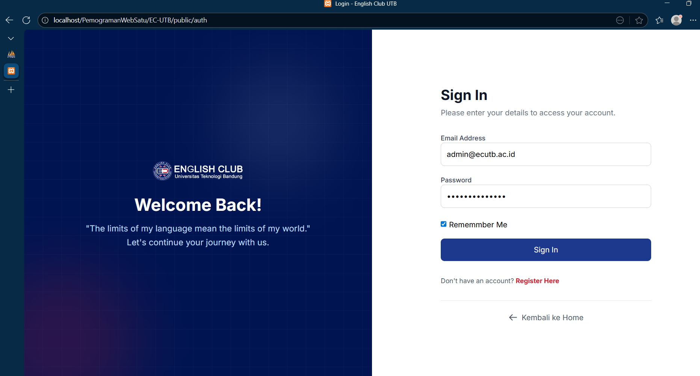
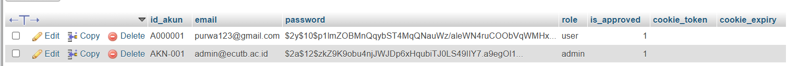
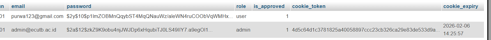
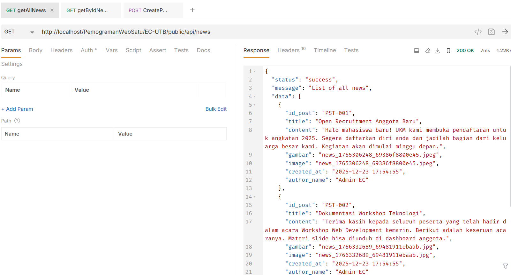
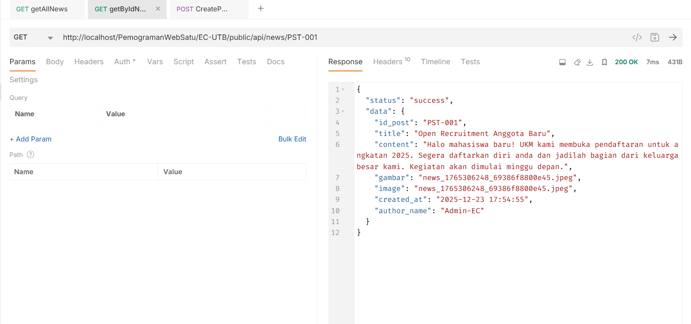
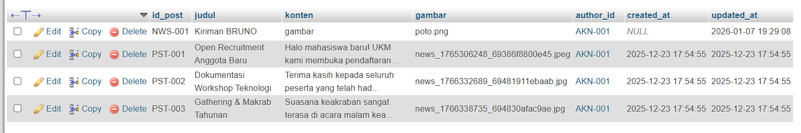
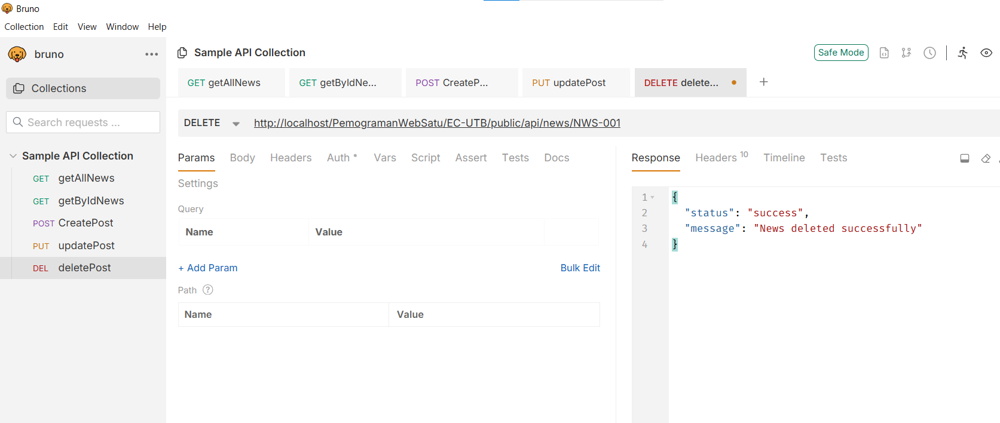
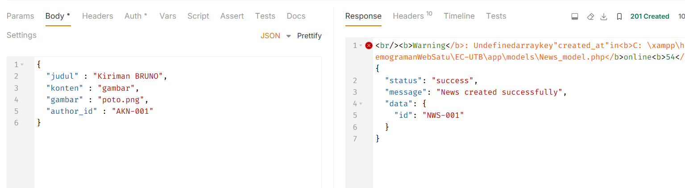

#  Dokumentasi Web & API

## Deskripsi Singkat
Project ini merupakan aplikasi web yang menyediakan beberapa fitur utama seperti:
- Login pengguna
- Manajemen berita / post (CRUD)
- Dashboard admin
- Penggunaan **cookie & token** untuk autentikasi
- Endpoint API untuk pengambilan data

Dokumentasi ini dibuat untuk menampilkan **seluruh perintah / fitur** dalam bentuk **screenshot** sebagai bagian dari tugas.

---
## Link Web : 

    https://zykone.web.id/public/

akun
- email : admin@ecutb.ac.id
- pass  : adminecutb$123

---

## Struktur Folder Dokumentasi

Semua screenshot dokumentasi disimpan di folder:

Isi folder tersebut adalah bukti visual dari setiap fitur dan endpoint yang tersedia.

---

## Autentikasi

### 1. Halaman Login
Digunakan untuk masuk ke sistem sebelum mengakses dashboard atau fitur lain.

---

### 2. Cookie Token Tidak Ada
Kondisi ketika user mengakses sistem tanpa cookie token.

---

### 3. Cookie Token Ada
Kondisi ketika cookie token sudah tersedia dan valid.

---

##  Dashboard Admin

### Dashboard Admin
Halaman utama setelah login berhasil.  
Digunakan untuk mengelola data berita/post.

---

## Manajemen Post / News

### 1. Get All News
Endpoint untuk mengambil seluruh data berita.

---

### 2. Get News By ID
Endpoint untuk mengambil satu data berita berdasarkan ID.

---

### 3. Create Post
Digunakan untuk menambahkan data berita baru ke database.

---

### 4. Update Post
Digunakan untuk memperbarui data berita yang sudah ada.

---

### 5. Delete Post
Digunakan untuk menghapus data berita.

---

## Database

### Struktur / Proses Create Data
Menampilkan proses insert data ke database.

---

### Contoh Data (Bruno)
Contoh data yang berhasil disimpan di database.

---

