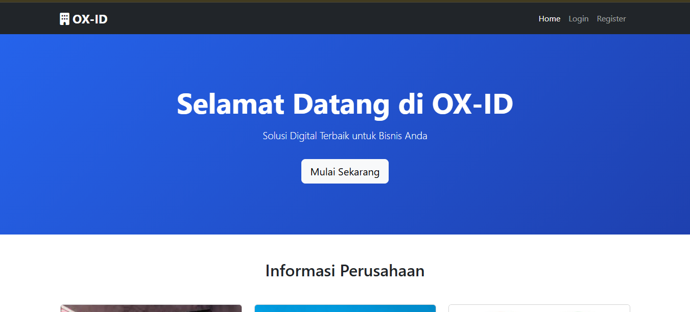
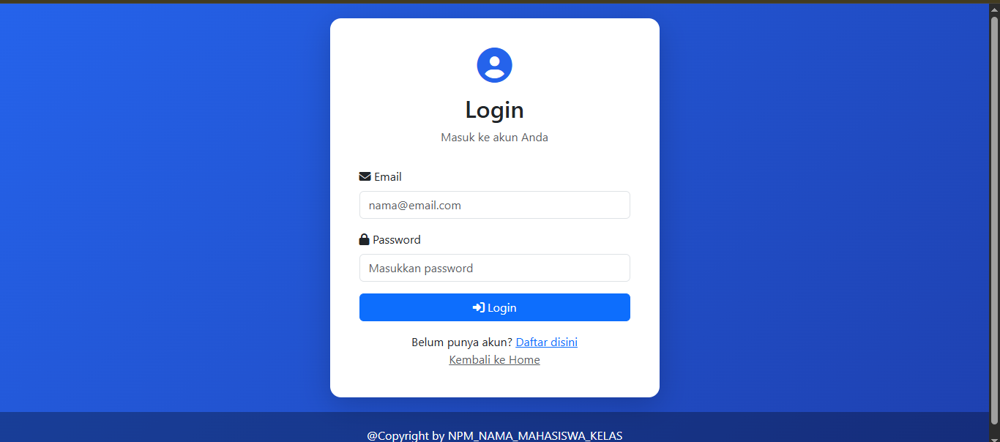
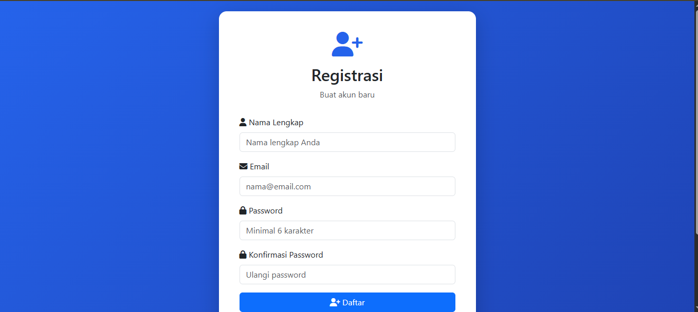
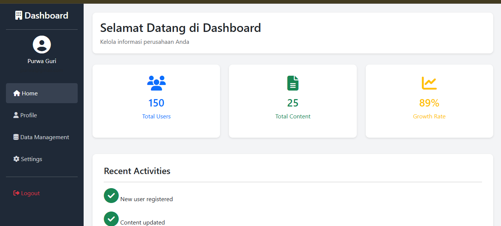
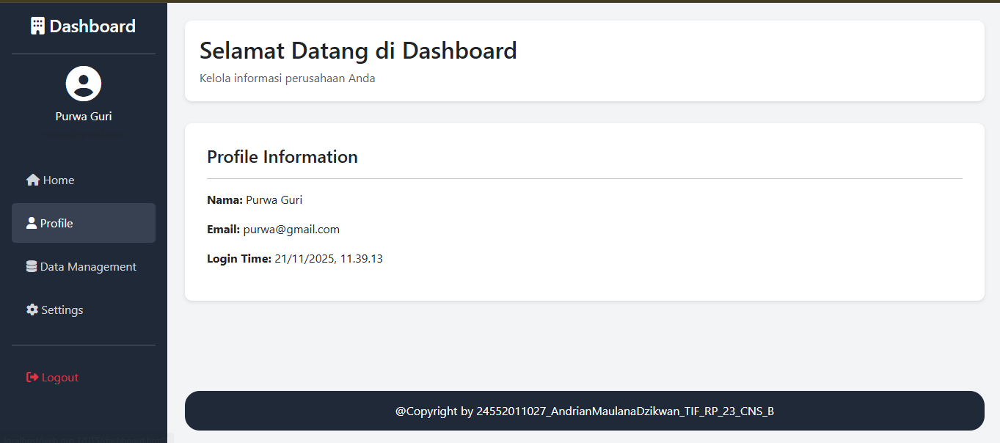
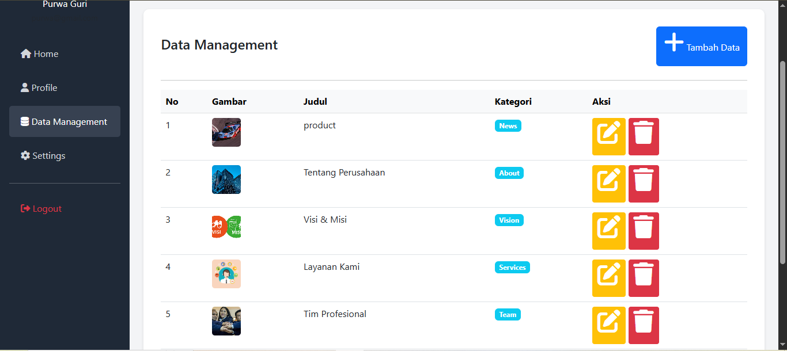
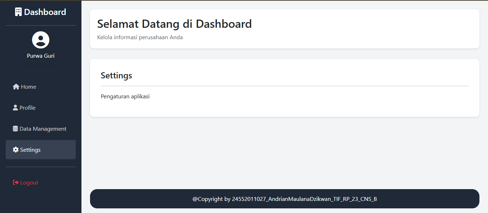

## 📸 Preview Aplikasi

Berikut adalah tampilan antarmuka dari aplikasi ini:

### 1. Halaman Utama (Landing Page)
Halaman depan yang dapat diakses oleh publik untuk melihat informasi perusahaan.

---

### 2. Autentikasi (Login & Register)
Fitur keamanan untuk admin atau user masuk ke dalam sistem.

| Halaman Login | Halaman Register |
| :---: | :---: |
|  |  |

---

### 3. Dashboard Admin
Pusat kontrol untuk mengelola data dan melihat statistik.

**Beranda Dashboard**
Menampilkan ringkasan statistik dan aktivitas terbaru.

**Manajemen Profil**
Halaman untuk melihat informasi akun yang sedang login.

**Manajemen dashboard_dataManagement**
Halaman untuk melihat informasi akun yang sedang login.

**Pengaturan (Settings)**
Halaman konfigurasi aplikasi.

