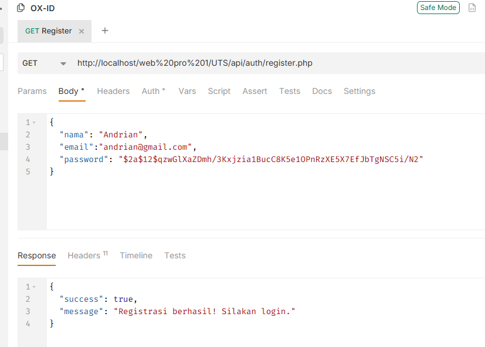
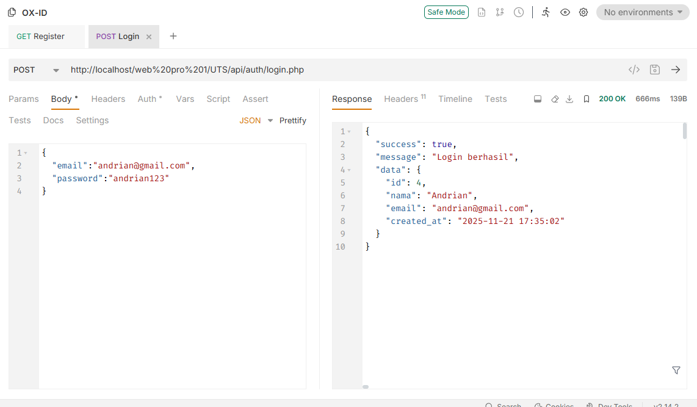
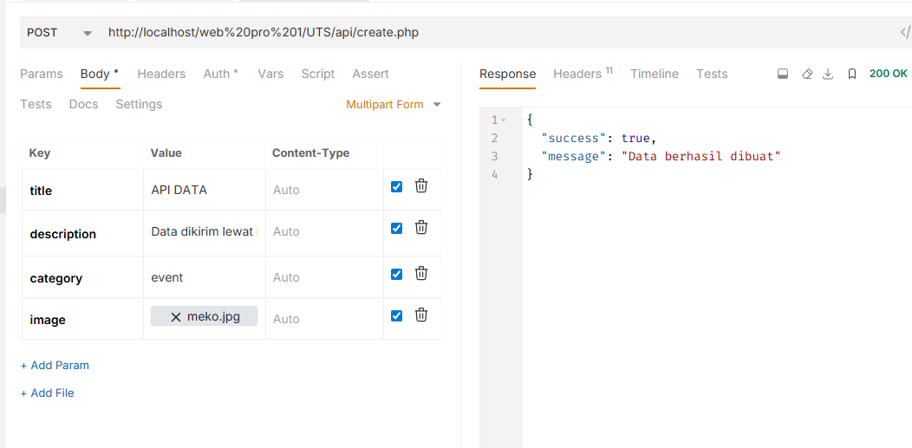
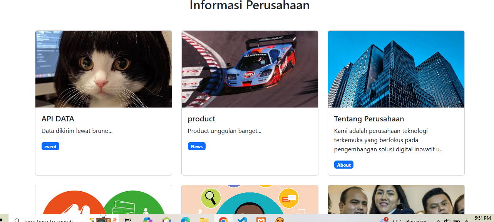
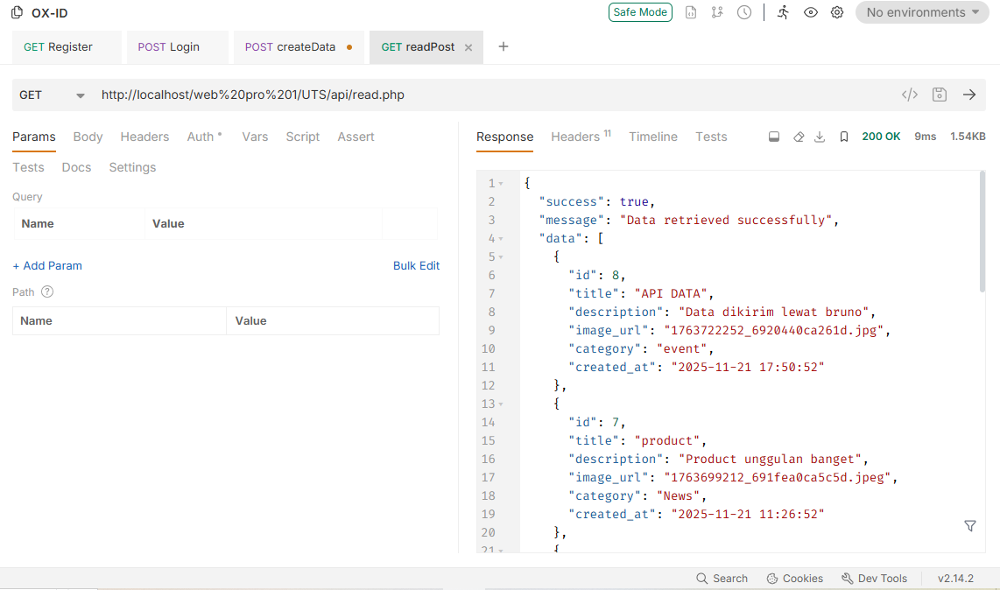
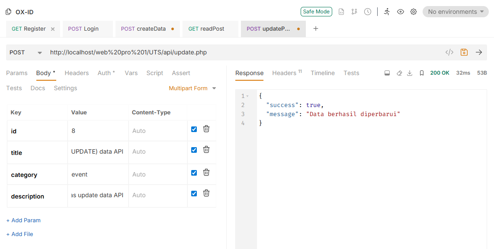
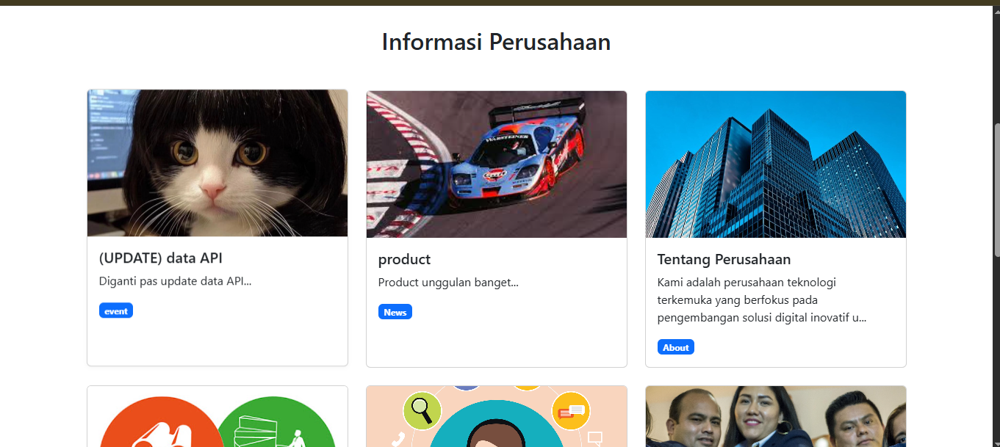
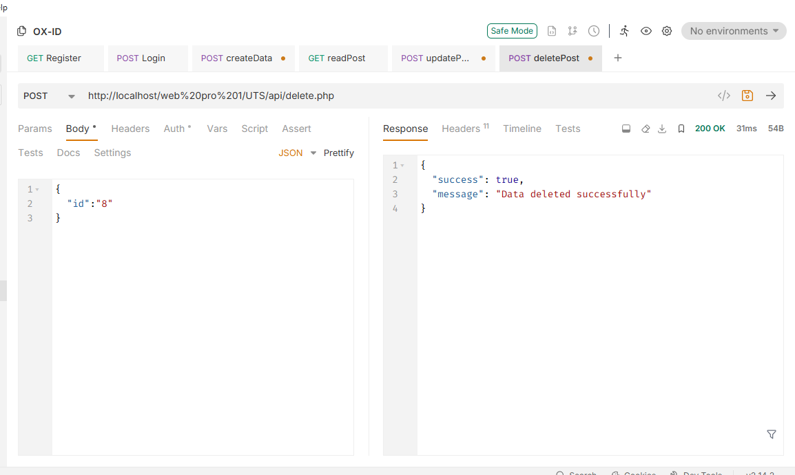

## Preview Aplikasi

## Project-01

### 1. Halaman Utama (Landing Page)
Halaman depan yang dapat diakses oleh publik untuk melihat informasi perusahaan.

---

### 2. Autentikasi (Login & Register)
Fitur keamanan untuk admin atau user masuk ke dalam sistem.

| Halaman Login | Halaman Register |
| :---: | :---: |
|  |  |

---

### 3. Dashboard Admin
Pusat kontrol untuk mengelola data dan melihat statistik.

**Beranda Dashboard**
Menampilkan ringkasan statistik dan aktivitas terbaru.

**Manajemen Profil**
Halaman untuk melihat informasi akun yang sedang login.

**Manajemen dashboard_dataManagement**
Halaman untuk melihat informasi akun yang sedang login.

**Pengaturan (Settings)**
Halaman konfigurasi aplikasi.

---

## Project-02

## Dokumentasi Pengujian API (Bruno)

Berikut adalah hasil uji coba (Testing) setiap endpoint API yang telah dibuat.

### 1. Autentikasi User
Pengujian fitur pendaftaran dan login user untuk mendapatkan akses.

| **Register User** | **Login User** |
| :---: | :---: |
|  |  |

---

### 2. Create Data (Upload Gambar)
Pengujian endpoint `create.php` menggunakan method **POST** dengan tipe body **Multipart Form**.

| **Request (Bruno)** | **Response Sukses / Database** |
| :---: | :---: |
|  |  |

---

### 3. Read Data
Pengujian endpoint `read.php` menggunakan method **GET** untuk mengambil seluruh data.

**Menampilkan Data JSON:**

---

### 4. Update Data
Pengujian endpoint `update.php` untuk mengedit data. Mendukung penggantian gambar lama dengan yang baru.

| **Request Update (Multipart)** | **Response Sukses** |
| :---: | :---: |
|  |  |

---

### 5. Delete Data
Pengujian endpoint `delete.php` untuk menghapus data dari database.

| **Request Delete** | **Response Sukses** |
| :---: | :---: |
|  |  |

---