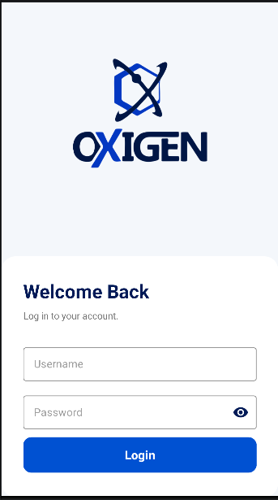
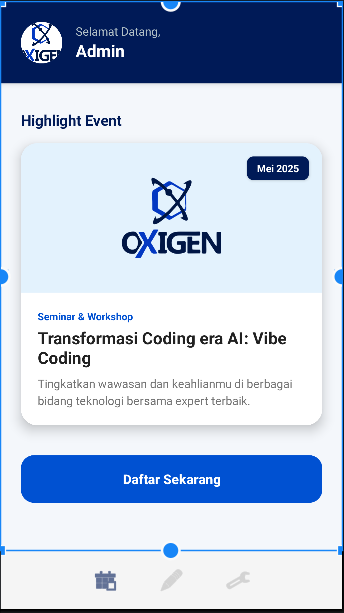
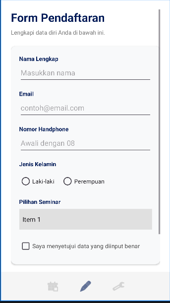
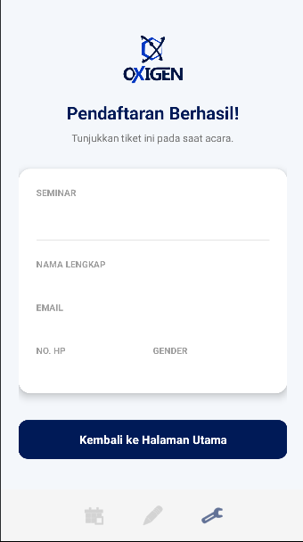

# Aplikasi Pendaftaran Seminar - UTS Pemrograman Mobile 1

Aplikasi berbasis Android ini merupakan pengembangan dari project Login dan Register, yang kini dilengkapi dengan fitur Pendaftaran Seminar Mahasiswa. Aplikasi ini dikembangkan dengan mengimplementasikan komponen Material Design serta validasi input yang komprehensif.

## 👤 Identitas Mahasiswa
- **Nama:** Andrian Maulana Dzikwan
- **Kelas:** TIF RP 24D CNS
- **Mata Kuliah:** Pemrograman Mobile 1
- **Dosen Pengampu:** Erryck Norrys, S.Kom
- **Universitas:** Universitas Teknologi Bandung (UTB)

## ✨ Fitur Aplikasi
1. **Login & Register:** Autentikasi sederhana untuk masuk ke dalam aplikasi.
2. **Halaman Utama:** Menampilkan nama pengguna dan akses ke form pendaftaran seminar.
3. **Form Pendaftaran:** Input data meliputi Nama, Email, Nomor HP, Jenis Kelamin (Radio Button), Pilihan Seminar (Spinner), dan Persetujuan (Checkbox).
4. **Validasi Input Real-Time:** - Seluruh field wajib diisi.
   - Email harus mengandung karakter `@`.
   - Nomor HP harus berupa angka, diawali dengan `08`, dan memiliki panjang `10-13` digit.
   - Peringatan jika checkbox persetujuan belum dicentang.
5. **Dialog Konfirmasi:** Pop-up konfirmasi (Ya/Tidak) sebelum mensubmit data pendaftaran.
6. **Halaman Hasil:** Menampilkan ringkasan data yang telah diinput beserta pesan "Pendaftaran Berhasil".

## 📸 Tangkapan Layar (Screenshots)

Berikut adalah tampilan antarmuka (UI) dari aplikasi ini:

### 1. Halaman Login / Register

### 2. Halaman Utama

### 3. Form Pendaftaran & Validasi

### 4. Halaman Hasil Pendaftaran

## 🎥 Video Penjelasan Project

Sesuai dengan ketentuan penilaian UTS, berikut adalah video penjelasan mengenai alur aplikasi, uji coba validasi, serta penjelasan *source code*:

**[ https://www.youtube.com/watch?v=ZDzm5FNml8E&t=297s ]**

---
*Dibuat menggunakan Kotlin/Java di Android Studio.*