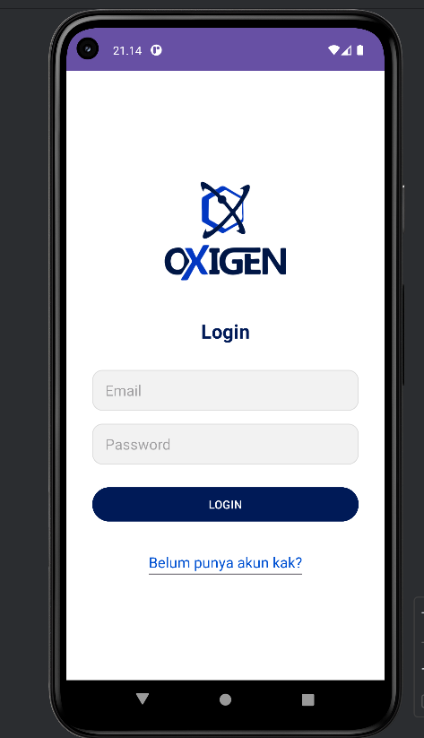
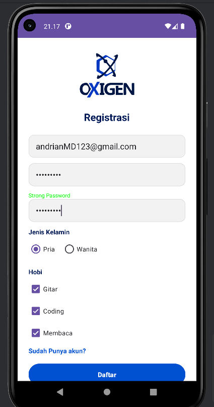
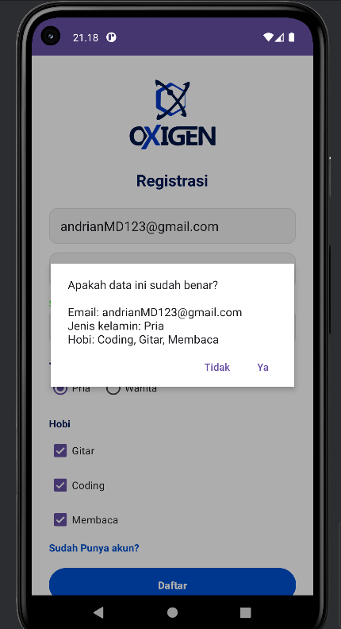

# Tugas Pemrograman 1  
## Membuat Layout Authentication Form

**Nama: Andrian Maulana Dzikwan**  
**Kelas: TIF RP 24 D CNS**  

---

## Deskripsi
Pada tugas ini, saya membuat layout Authentication Form yang terdiri dari beberapa tampilan, yaitu:
- Halaman Login
- Halaman Login Berhasil
- Halaman Register
- Pop-up Login & Register

Aplikasi ini berfokus pada pembuatan tampilan (UI layout) menggunakan konsep dasar pemrograman web.

---

## Demo Aplikasi
Berikut demo tampilan dari aplikasi yang telah dibuat:

### 1. Halaman Login

### 2. Halaman Login Sukses

### 3. Halaman Register

### 4. Pop-up Login & Register

---

## Penutup
Demikian tugas ini saya buat. Semoga hasil yang saya kerjakan dapat memenuhi kriteria yang telah ditentukan.

Terima kasih.